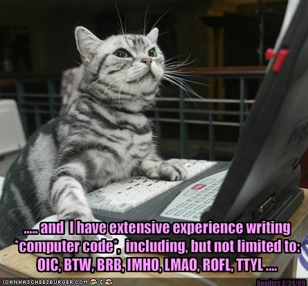

# Tips on staying out of dependency hell


# Agenda
1. Dependency Hell?
2. Why should you bother?
3. How you should bother!
4. The Code!


##Ask questions at any time

Don't be afraid to speak up srsly


## What is Dependency Hell™

Its when you're using transitive dependencies, and you don't realize it.


It might appear handy, but you will get burned as your project gets big!

Note:
Project growth. New Devs bringing in their favorite library. New features.
Library updates.


#Why you should bother


* You **know** what you're dependent upon
 * Transitive dependencies can change on upstream version changes
* Prompts thought about actually pulling in that dependency
 * Especially if you're building a platform
* Explicit dependencies help maven's reactor order builds
 * parallel builds!
 * dependency cycles!
 
Note:
In repose, we had this problem. Lots of modules, lots of dependencies, some were transitive accidentally.
This left us with dependency hell. Was trying to solve classpath conflict problems with spring-based stuff.


#How you should bother


A pair of maven build plugins <sup><small>(sort of)</small></sup>

* [maven-enforcer-plugin](http://maven.apache.org/enforcer/maven-enforcer-plugin/)
 * Enforcing banned dependencies
 * Enforcing illegal transitive dependencies
* [maven-dependency-plugin](http://maven.apache.org/plugins/maven-dependency-plugin/)


Maven enforcer plugin execution 1:
```xml
<execution>
  <id>enforce-banned-dependencies</id>
  <goals><goal>enforce</goal></goals>
  <configuration>
    <rules>
      <bannedDependencies>
        <excludes>
          <exclude>commons-logging:commons-logging</exclude>
        </excludes>
        <searchTransitive>true</searchTransitive>
      </bannedDependencies>
    </rules>
    <!-- fail fast makes it bomb after the first failure -->
    <failFast>true</failFast>
  </configuration>
</execution>
```
Note:
Ban some dependencies! Some configuration omitted.
Useful with slf4j, log4j and apache commons logging


Execution 2 needs a little [special sauce](https://github.com/ImmobilienScout24/illegal-transitive-dependency-check):
```xml
  <dependencies>
    <dependency>
      <groupId>de.is24.maven.enforcer.rules</groupId>
      <artifactId>illegal-transitive-dependency-check</artifactId>
      <version>1.7.2</version>
    </dependency>
  </dependencies>
```

Note:
Was somewhat hard to find. A plugin to a plugin


Execution 2:
```xml
<execution>
  <id>enforce-transitive-dependency-explicitness</id>
  <phase>process-test-classes</phase>
  <goals><goal>enforce</goal></goals>
  <configuration>
    <rules>
      <illegalTransitiveDependencyCheck
          implementation="de.is24.maven.enforcer.rules.IllegalTransitiveDependencyCheck">
        <reportOnly>false</reportOnly>
        <useClassesFromLastBuild>true</useClassesFromLastBuild>
        <suppressTypesFromJavaRuntime>true</suppressTypesFromJavaRuntime>
        <regexIgnoredClasses>
          <regexIgnoredClass>org\.apache\.http\..+</regexIgnoredClass>
          <regexIgnoredClass>com\.typesafe\.scalalogging\..+</regexIgnoredClass>
        </regexIgnoredClasses>
      </illegalTransitiveDependencyCheck>
    </rules>
  </configuration>
</execution>
```

Note:
* When to run it (process-test-classes). 
* ReportOnly. 
* UseClassesFromBuild.
* Ignored classes Regex


# The Code
Let's see some [actual code](https://github.com/dkowis/satjug-transitive-demo)


Note: Pull up the code, bro


## Thanks!

David Kowis

|    |   |
|------------------------------- |
| email   | dkowis@[gmail.com,shlrm.org] |
| Twitter | [@BeepDog](www.twitter.com/BeepDog) |
| web     | [blog.shlrm.org](http://blog.shlrm.org) |

